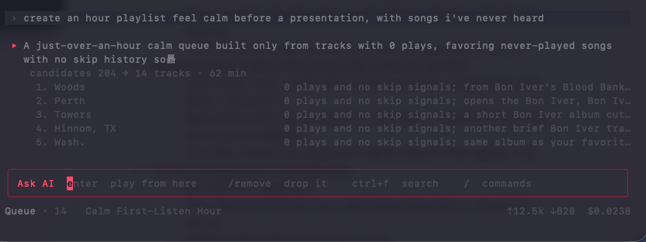
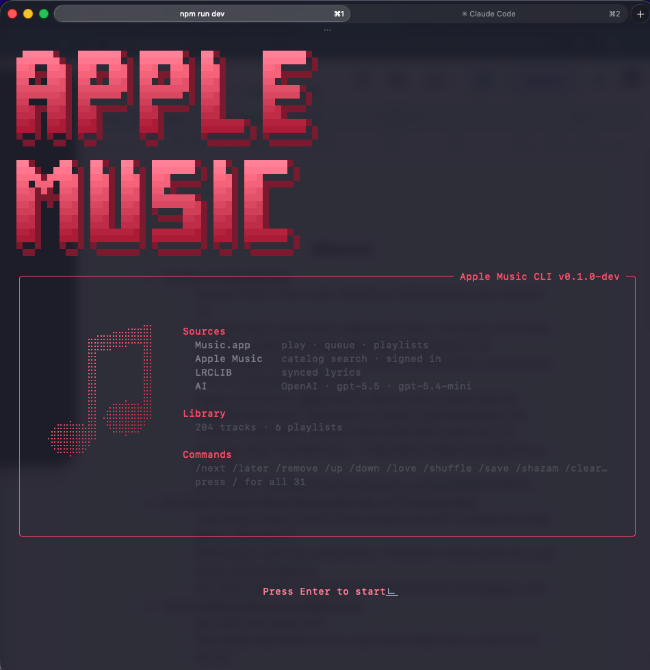
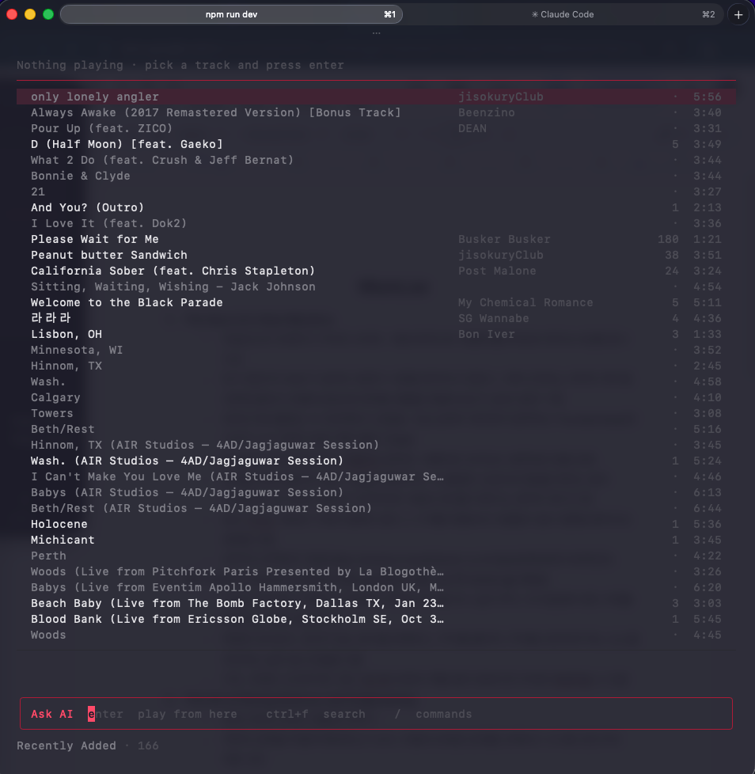
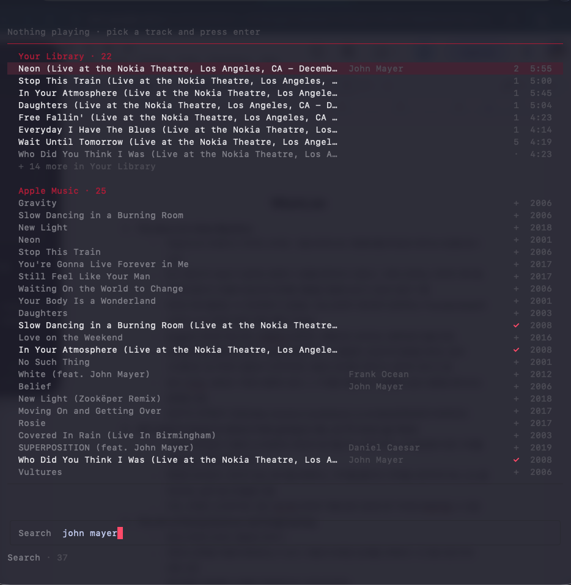
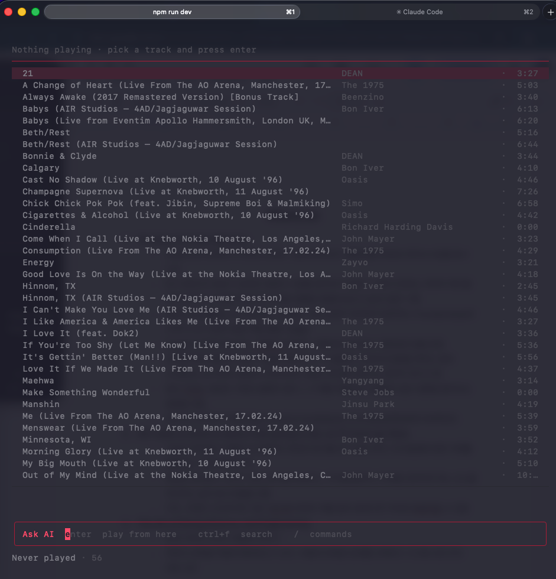
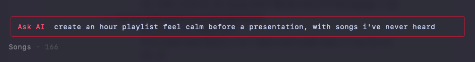
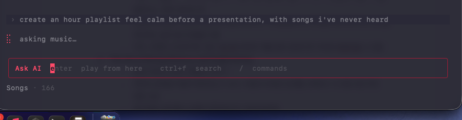
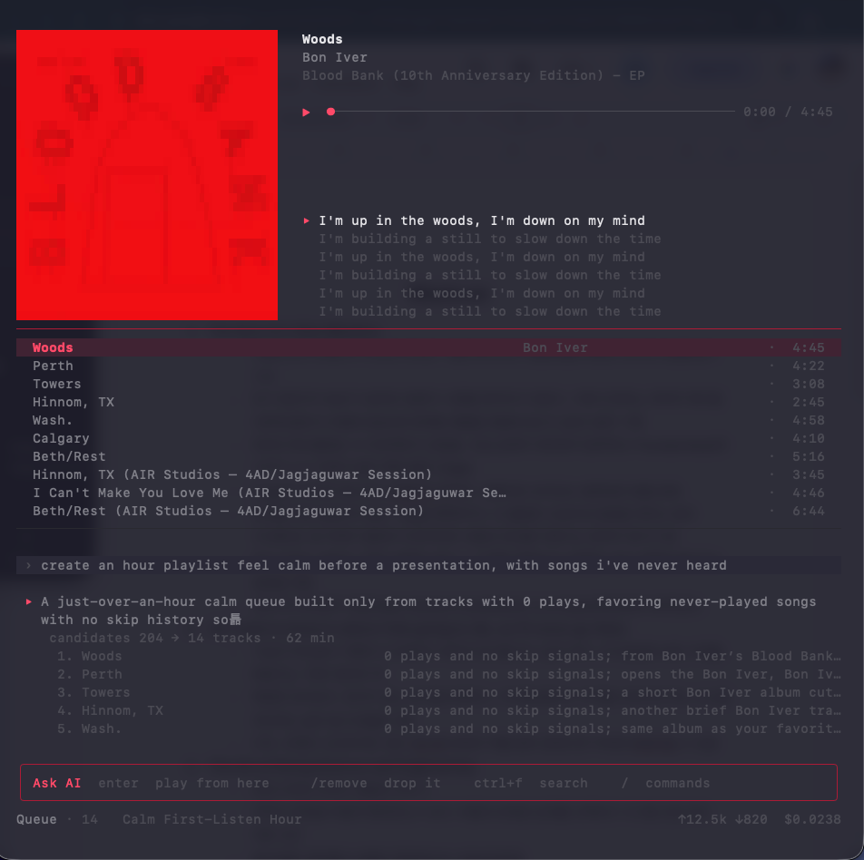

# Apple Music CLI

터미널에서 **말로 음악을 고른다.** 담아두고 한 번도 안 들은 곡을 찾아
큐를 짓고, 왜 그 곡을 골랐는지 말한다.

> **네 것만 튼다.** 진짜 Music.app 에 붙어서 네 라이브러리를 읽고, 네
> 스피커로 튼다. 추천은 남의 취향이 아니라 **네가 담아두고 안 들은 곡**에서
> 나온다.



```
› create an hour playlist feel calm before a presentation, with songs i've never heard

▸ A just-over-an-hour calm queue built only from tracks with 0 plays, favoring
  never-played songs with no skip history
    candidates 204 → 14 tracks · 62 min
     1. Woods      0 plays and no skip signals; from Bon Iver's Blood Bank…
     2. Perth      0 plays and no skip signals; opens the Bon Iver…
```

**무엇을 왜 골랐는지가 그 자리에 있다.** 후보가 몇 곡이었고, 무엇을 골랐고,
얼마나 걸리고 얼마 썼는지까지.

---

## 받아서 쓰기

[Releases](../../releases) 에서 `amcli.zip` 을 받아 압축을 푼다.
애플 공증을 받았으므로 Gatekeeper 가 막지 않는다.

```sh
./amcli
```

처음 켜면 두 가지를 묻는다. **둘 다 건너뛸 수 있고, 건너뛰면 그 기능만 꺼진다.**

| | 하는 일 | 건너뛰면 |
|---|---|---|
| Music.app 자동화 권한 | 재생·큐·플레이리스트 | 앱이 화면으로 안내한다 |
| `/ai <key>` | **말 걸어서 큐 만들기** | 검색·재생만 |

애플 뮤직 전체 검색은 **아무것도 안 해도 된다** — 배포물에 토큰이 박혀 있다.

---

## 화면

| | |
|---|---|
|  | **첫 화면** — 무엇에 붙어 있고 무엇이 꺼져 있는지 |
|  | **라이브러리** — 커버·가사·재생 위치 |
|  | **검색** — 내 것과 아직 내 것이 아닌 것을 함께 |
|  | **한 번도 안 들은 곡** — 이 서비스가 말하려는 것 |
|  | **요청** — 자연어 한 줄 |
|  | **기다리는 중** — 무엇을 물었는지가 남아 있다 |
|  | **저장** — Apple Music 플레이리스트로 |

---

## 조작

| 키 | |
|---|---|
| 아무 글자 | 요청 — "조용한 거 25분치" |
| `shift+tab` | `Agent` ⇄ `Search` |
| `/` | 갈 곳과 할 것 |
| `ctrl+j` | 대화 접기 · 펴기 |
| `esc` | 한 단계씩 물러난다 |

알파벳 단축키는 두지 않는다. **입력창이 늘 활성인 구조에서는 자연어와
반드시 충돌한다** — `s`=스킵을 두면 *"sad한 곡으로"* 의 첫 글자가 먹힌다.

---

## 무엇에 붙어 있나

| | | |
|---|---|---|
| **Music.app** | 재생 · 큐 · 플레이리스트 | AppleScript |
| **Apple Music** | 카탈로그 검색 · 담기 | 개발자 토큰 |
| **LRCLIB** | 재생 위치를 따라가는 가사 | 애플은 서드파티에 안 준다 |
| **OpenAI** | 선곡과 근거 | 네 키로 돈다 |

가사 커버리지는 실측 **92%** 다 — `spikes/lrclib-coverage`.

---

## 만들기

```sh
scripts/release.sh        빌드 · 서명 · 공증 · 검역 검증  → dist/amcli.zip
scripts/build.sh --dev    토큰 없이. 각자 자기 설정으로
cd tui && go test ./...
```

자세한 것은 [`tui/README.md`](tui/README.md), 설계는 [`docs/`](docs/).
